# 图形学实验报告

> 范孙奇 计11 2020012497

## 完成功能

- 基础项

  - 折射                                                        已实现，pt和ppm中都有实现
  - 反射                                                        已实现，pt和ppm中都有实现
  - 阴影                                                        已实现，包含在软阴影里面
  - 参数曲面			                                    已实现

- 高

  - 求交加速（包围盒和层次结构）          已实现
  - 焦散                                                        已实现（ppm中）  体现在水中
  - 体积光

- 中

  - 位移贴图                                           
  - 漫反射                                                    已实现，pt和ppm中都有漫反射
  - 景深                                                        已实现
  - 运动模糊		                                        已实现
  - 色散                                                      
  - 软阴影                                                    已实现

- 低

  - 抗锯齿                                                    已实现
  - 纹理贴图                                                已实现
  - 凹凸贴图                                                已实现
  - 法线贴图		
  - 法向插值                                                已实现

## 算法选型

### PT

路径追踪算法，因为在课程上已经详细讲解过，因此在这篇实验报告中只进行代码实现的简要说明。

#### PT::Path_Tracer

遍历一张图上的所有像素，每一个像素发出一条光线。采用蒙特卡洛方法模拟```pt_samples```次，每次都对这条光线调用```radiance```方法得到颜色。为了随机化有对光线出发点加扰动：
```C++
Vector2f ori = Vector2f(x + RND1 / 2, y + RND1 / 2);
Ray camRay = camera->generateRay(ori);
```

最后这个像素的颜色取的是这```pt_samples```次模拟的平均值：

```C++
finalColor = finalColor / float(pt_samples);
finalColor = Vector3f(toFloat(finalColor.x()), toFloat(finalColor.y()), toFloat(finalColor.z()));
myImage.SetPixel(x, y, finalColor);
```

#### PT::radiance(Ray ray, Group* group, int depth)

这个函数的功能：对于一条光线，得到它的颜色。本质上就是smallPt中的```radiance```函数。

首先判断光线与一组几何体(group)有没有相交：

```
bool isIntersect = group->intersect(ray, hit, 0, RND2);
```

没有相交就返回黑色。如果相交了，会把交点的信息写到```hit```变量中去。然后调用```hit```的相关方法得到交点的```material```与```hit_color```。

然后模仿smallPt中的这段代码：

```C++
// 判断是否迭代结束
Vec3d f = obj.c;
double p = f.x > f.y && f.x > f.z ? f.x : f.y > f.z ? f.y : f.z;
if (++depth > 5)
{
    if (erand48() < p)
        f = f * (1 / p);
    else
        return obj.e;
}
```

`f`是物体的颜色，有```f.x```, ```f.y```和```f.z```三个分量，`p`应该是从这三个分量中取了一个最大值。

下面就是随机选择。有一定的概率这个`radiance`函数直接就被终止了，返回`obj.e`，即这个物体的辐射属性。另外有一定的概率，会对颜色进行normalize (```f = f * (1 / p);```)，然后这个`f`会参与到之后反射、折射、漫反射的光线的辐射值的计算中。

注意```radiance```函数中又会调用```radiance```函数，应该就是模拟一条光线在空间中不断地撞上物体，发生反射、折射和漫反射。这个过程可以迭代很长时间，所以应该是为了节省计算时间，我们要在迭代深度 > 5 的情况下（```++depth > 5```），有一定概率去终止这个迭代过程。

为什么颜色需要normalize (```f = f * (1 / p);```)，这一点还没有想清楚...

### PPM

我还实现了渐进式光子映射（Progressive Photon Mapping，PPM）这种算法选型。

为了弄懂PM，PPM 算法的原理，我主要参考了这篇博文：https://zhuanlan.zhihu.com/p/396442970。简而言之，Photon Mapping 算法是指光子从光源处随机方向发射，并在**一切表面**上弹射，在**diffuse表面**上吸收并记录在一张全局光子图中，再用光线追踪算法得到颜色。

PPM 算法则先从相机发射观察点，再从光源一轮一轮地发射光子，并不断更新观察点的颜色。因此，PPM 算法有从相机发射观察点、记录光子、观察点参数累加得到最终像素三个主要过程。

参考上面的博文，PPM 算法的伪代码可以表示为：

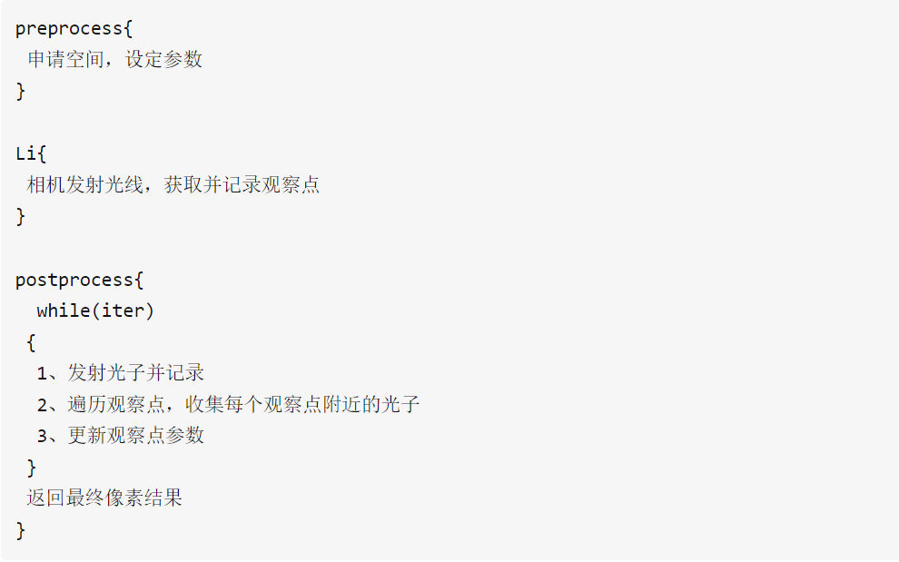

参考这篇博文https://zhuanlan.zhihu.com/p/208356944， PPM算法的伪代码为：

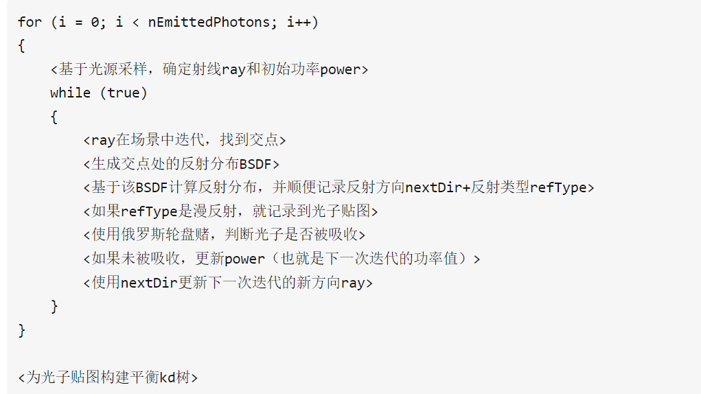

两者其实是一致的。

在我的代码实现上，主要封装在了```PPM```这一个类中。PPM这个类主要有以下这几个函数。

#### trace()

```PPM::trace()```函数是实现 PPM 算法的主要函数。它依次调用了如下函数：

+ ```pt_and_record_view_point()```，从一个相机上发射光线，并记录光线上的视点/观察点
+ ```postprocess()```，负责下面这些功能：
  + 发射光子并记录
  + 遍历观察点，收集每个观察点附近的光子
  + 更新观察点参数
+ ```caustic()```，处理焦散，算是附加功能，在实现功能中具体讲到。

最后，trace() 函数会把从相机出发的一条光线上的所有光子能量累加起来，得到最终的像素颜色。具体代码如下：

```C++
Vector3f img[w * h];
for(int i = 0; i < w * h; ++i)
    img[i] = Vector3f::ZERO;
for(auto it = view_pointmap.begin(); it != view_pointmap.end(); ++it) {
    Vector3f total_photon_power = (*it).accumulate_photon_power / (M_PI * (*it).radius * (*it).radius * (caustic_photon_total + photon_total));
    Vector3f color = (*it).accumulate_power + (*it).power_rate * total_photon_power;
    img[(*it).pixel_y * w + (*it).pixel_x] += color;
}
for (int x = 0; x < w; ++x) {
    for (int y = 0; y < h; ++y) {
        Vector3f finalColor = img[y * w + x] / ppm_samples;
        finalColor = Vector3f(toFloat(finalColor.x()), toFloat(finalColor.y()), toFloat(finalColor.z()));
        myImage.SetPixel(x, y, finalColor);
        finalColor.print();
    }
}
```

#### pt_and_record_view_point

该函数负责路径追踪和记录视点。下面我结合代码，挑选主要段落解释该函数。

+ 外层循环（x 轴）和内层循环（y 轴）遍历图像的每个像素，用于构建光线并进行路径追踪。针对每个像素的每次采样，首先根据像素位置和随机扰动生成光线的起点 ```ori```。

  其中```ppm_samples```变量表示每个像素采样的次数，用于增加路径追踪的随机性。(这其实是一种蒙特卡洛方法。由于存在漫反射面反射、折射面折射与反射导致光线分叉、部分镜面反射等不确定情况，因此采用蒙特卡洛模拟方法，对每一个像素多次发出射线，射线接触物体过程中的漫反射、折射面光线分叉、部分镜面反射的情况都根据物理定律计算相应概率，根据概率进行决策，将每次发出射线的色彩贡献取平均作为该像素点的颜色)。

  ```C++
  for (int x = 0; x < w; ++x) {
          for (int y = 0; y < h; ++y) {
              for (int s = 0; s < ppm_samples; s++) {
                  Vector2f ori = Vector2f(x + RND1 / 2, y + RND1 / 2);
                  Ray camRay = camera->generateRay(ori);
  ```

+ 和 PT 算法一样，在迭代深度限制与光子新能量足够小的限制下，进行路径追踪。

  ```C++
  while(true) {
          if(dep > ppm_max_depth)
              break;
          else if (new_power.x() < 1e-3 && new_power.y() < 1e-3 && new_power.z() < 1e-3)
              break;
          // 进行路径追踪算法
  }
  ```

+ 判断光线是否与场景中的物体相交（```isIntersect```）。如果相交，获取相交点的材质信息和颜色。如果相交点没有纹理信息，则使用材质的颜色。如果光线未与场景中的物体相交，结束当前路径。

  ```C++
  if(isIntersect) {
      Material* material = hit.getMaterial();
      bool is_texture;
      Vector3f hit_color = hit.get_color(is_texture);
      if(!is_texture)
          hit_color = material->color;
  
      Vector3f hit_emission = material->emission;
      Vector3f hit_normal = hit.getNormal().normalized();
      Vector3f next_origin = camRay.getOrigin() + hit.getT() * camRay.getDirection();
      Vector3f ray_direction = camRay.getDirection().normalized();
      Vector3f next_direction;
  ```

+ 对于每个场景中的光源，判断是否与相交点之间没有遮挡，并且光源在相交点的**半径**范围内。如果满足条件，将光源的辐射能量与新能量值相乘，并累加到```accumulate_power```中。

+ 根据材质的类型随机决定下一步的行为。

  + 如果是漫反射材质，将当前像素的位置、光线起点、初始光子半径等信息记录到 ```view_pointmap``` 中，并结束当前路径。

    ```C++
    if(type_decision < material->type.x()) {//漫反射
        ViewRecord vr(x, y, next_origin, ini_photon_radius);
        vr.power_rate = new_power;
        vr.accumulate_power = accumulate_power;
        view_pointmap.push_back(vr);
        break;
    }
    ```

  + 如果是镜面反射材质，计算反射方向，并更新光线的方向为反射方向。

    ```C++
    else if(type_decision < material->type.x() + material->type.y()) {//镜面反射
        Vector3f next_direction = ray_direction - hit_normal * (b * 2);
        next_direction.normalize();
        camRay.direction = next_direction;
    }
    ```

  + 如果是折射材质，根据菲涅尔项的估计和折射率计算反射概率 ```Rprob```。如果随机数小于 ```Rprob``` 或者折射角 ```cos2``` 小于等于 0，则进行反射，更新光线的方向为反射方向；否则进行折射，更新光线的方向为折射方向。具体建模可见下一小节菲涅尔项的计算。

    ```C++
    else  {
        float n = material->refractive_index;
        float R0 = ((1.0 -n) * (1.0 - n)) / ((1.0 + n) * (1.0 + n));
        if(b > 0) {
            hit_normal.negate();
        } else {
            n = 1.0 / n;
        }
        float cos1 = -Vector3f::dot(hit_normal, ray_direction);
        float cos2 = 1.0 - n * n * (1.0 - cos1 * cos1); //cos(theta2)的平方
        Vector3f reflect = (ray_direction + hit_normal * (cos1 * 2));
        //Schlick估计菲涅尔项
        float Rprob = R0 + (1.0 - R0) * pow(1.0 - cos1, 5.0);
        Vector3f refrac =  ((ray_direction * n) + (hit_normal * (n * cos1 - sqrt(cos2)))).normalized();
    
        if (RND2 < Rprob || cos2 <= 0) {
            camRay.direction = reflect;
            // cout << x << " " << y << " " << s << " rprob:" << Rprob << " fanshe at";
            // next_origin.print();
            // camRay.direction.print();
        } else {
            camRay.direction = refrac;
    	}
    }
    ```

##### 菲涅尔项的计算

在光线与介质边界交互时，一部分光线会被反射，另一部分则会被折射。菲涅尔项是用于估计反射和折射之间能量分配的模型。它基于入射光线与表面法线之间的夹角以及介质的折射率来计算反射和折射的概率。

在代码中的菲涅尔项估计部分，我们首先计算入射光线与表面法线的夹角 ```cos1```（通过计算入射光线方向与表面法线的点积得到）。然后，我们使用折射率来计算折射角 ``cos2``，根据 Snell's Law（斯涅尔定律）的公式：

$cos2 = \sqrt{(1.0 - n * n * (1.0 - cos1 * cos1))}$

其中，$n$ 是材质的折射率。

接下来，我们计算反射概率 ```Rprob```。根据菲涅尔方程，反射概率可以通过以下公式估计：

$R_0 = \frac{(1.0 - n) * (1.0 - n)}{  (1.0 + n) * (1.0 + n)}$

$ Rprob = R_0 + (1.0 - R_0) * {(1.0 - cos1)}^5$

其中，$R_0$ 代表入射光线在垂直入射的情况下的反射概率。

最后，我们生成一个随机数 ```RND2```，如果 ```RND2``` 小于 ```Rprob``` 或者折射角 ```cos2``` 小于等于 0，则认为光线会被反射，更新光线的方向为反射方向；否则，认为光线会被折射，更新光线的方向为折射方向。这样，通过菲涅尔项的估计，我们可以在光线与介质边界交互时，根据入射角和折射率来估计反射和折射的概率，并据此决定光线的行进方向。这样可以更准确地模拟光线与材质交互的物理现象。

#### postprocess

上述代码是PPM算法中的后处理（postprocess）阶段的代码。在该阶段，算法会生成光子图，并使用该图来估计场景中的光照贡献。也就是说该段代码的主要作用是处理数据结构`PhotoMap`中的一个一个光子，下面我将进行详细讲解。

以下是代码的主要步骤解释：

+ 初始化参数：首先，将传递给算法的光子发射次数（```pass_count```）保存到变量 ```_pass_count``` 中，将每个光源发射的光子数量平均分配给每个光源（```per_light_photon_count```）。在实际操作中，一般设定光子发射次数为 5 或者 6。通过```while```循环，一遍一遍地进行光子发射的过程。

  ```C++
  int _pass_count = pass_count;
  int per_light_photon_count =  per_sample_photon_count / scene.getNumLights();
  while(_pass_count--) {
  	...
  }
  ```

+ 迭代每个光源和每个光源发射的光子数量，生成光子图。对于每个光源，通过调用 ```light->get_ray(photon_power) ```获取发射的光子的光线和初始能量信息。

  ```C++
  for (int li = 0; li < scene.getNumLights(); li++) {//这里先只渲染圆盘光
      for (int i = 0; i < per_light_photon_count; i++) {
          Light* light = scene.getLight(li);
          Vector3f photon_power;
          Ray light_ray = light->get_ray(photon_power);
          ...
     }
  }
  ```

+ 光线追踪：从光源发射的光子的光线进行光线追踪，与场景中的物体相交。在追踪过程中，记录相交点的信息，并根据相交点的材质属性进行反射、折射等操作。这一部分和 PT 算法相差不大。

  ```C++
  while(true) {
      Hit hit;
      if(dep > ppm_max_depth)
          break;
      else if (photon_power.x() < 1e-3 && photon_power.y() < 1e-3 && photon_power.z() < 1e-3)
          break;
      bool is_intersect = group->intersect(light_ray, hit, 0, RND2);
      dep++;
      ...
  }
  ```

+ 光子存储：根据材质的类型决定光线的下一方向，并根据光线与表面的相交情况，将光子的位置、方向和能量信息存储在 PhotonMap 中。

  ```C++
  Photon* pho = new Photon(next_origin, ray_direction, photon_power);
  PhotonMap.push_back(pho);
  ```

+ 轮盘赌采样：对于漫反射材质，根据表面的颜色信息进行轮盘赌采样，判断光子是否被吸收或继续反射。

  ```C++
  //轮盘赌判断是否被吸收
  float p = hit_color.x() > hit_color.y() && hit_color.x() > hit_color.z() ? hit_color.x() : hit_color.y() > hit_color.z() ? hit_color.y() : hit_color.z();
  p = p < 0.75 ? p : 0.75;
  if(RND2 < p) {
      hit_color = hit_color / p;
  } else {
      break;
  }
  ```

+ 更新光子能量：根据相交点的材质发射的能量和表面的颜色信息，更新光子的能量。

  ```C++
  photon_power = hit_emission + hit_color * photon_power;
  ```

+ 光子图构建：重复步骤2至步骤6，直到生成足够数量的光子，形成光子图。

+ 构建光子 KD 树：使用光子图中的光子信息构建 KD 树，以便进行快速的光子查询。利用光子 KD 树和之前构建的视点记录（view_pointmap），进行光线追踪与光照估计。通过遍历视点记录，并查询光子 KD 树，计算每个像素的间接光照贡献。

  ```C++
  Photon_KDtree tree(PhotonMap.begin(), PhotonMap.end());
  if(pass_count == _pass_count + 1)
      traverse_viewpoint(tree, true);
  else
      traverse_viewpoint(tree);
  ```

  其中```traverse_viewpoint```即为把第一步```pt_and_record_view_point```中得到的视点遍历、处理一遍，查询光子 KD 树，计算在半径范围内的光子对视点的影响，得出各个视点的能量。

## 实现功能

### 焦散

焦散现象的概念可见这篇文章https://zhuanlan.zhihu.com/p/385099523?utm_id=0，简便起见，这里直接放图：

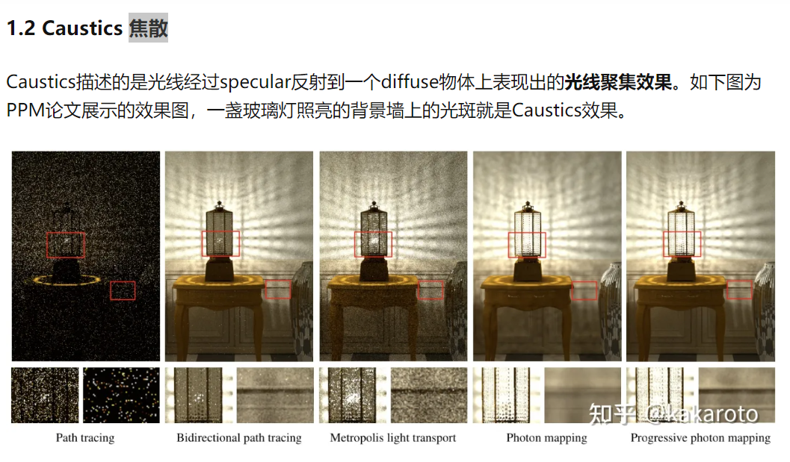

焦散功能实现在PPM算法中，主要体现为```PPM::caustic```函数。这个函数会生成焦散光子图，并使用该图来估计场景中的焦散光照贡献。

对焦散光子的处理大致和 PPM 算法中对普通光子的处理是一样的，有以下细微的不同：

+ 只发射一次光子
+ 只处理 specular的光子，具体来说是指镜面反射与折射的光子。有关材质的讨论可以参考这篇知乎 https://zhuanlan.zhihu.com/p/541037784 或者 GAMES101.

### 法向插值

三角面片的法向插值，即利用三角形三个顶点的法向量插值计算出三角面片上任一点的法向量，具体实现在```triangle.hpp```文件中。

```C++
Vector3f get_norm(const Vector3f& p) {
    if(!is_norm)
        return this->normal;
    Vector3f va = (vertices[0] - p), vb = (vertices[1] - p), vc = (vertices[2] - p);
    float ra = Vector3f::cross(vb, vc).length();
    float rb = Vector3f::cross(vc, va).length();
    float rc = Vector3f::cross(va, vb).length();
    return (ra * an + rb * bn + rc * cn).normalized(); // 加权平均
}
```

在```triangle.hpp```的```intersect```方法中调用，用于计算三角面片与光线交点的法向量。

### 参数曲面

#### curve.hpp

首先，在```curve.hpp```文件的```curve```基类中增添了```get_t```与```is_on_curve```方法。

+ ```get_t```方法是根据点的坐标```x```, ```y```来估计参数曲面的参量```t```，期望获得一个比较精确的初始``t``值。这需要我们预先对曲线进行离散化处理（在之前的PA中我们已经实现好了对贝塞尔曲线和B样条曲线进行离散化的功能）。
+ ```is_on_curve```方法检查一个三维点```(x,y,z)```是否在参数曲线上面。

+ ```get_point(float t_, Vector3f& point, Vector3f& grad) ```方法，对贝塞尔曲线和B样条曲线分别进行重载，根据t计算曲线上的点以及对应梯度。

#### revsurface.hpp

##### bool inter_AABB(const Ray &r, Hit &h, float & x_, float & y_)

看光线与AABB包围盒是否相交

##### bool intersect(const Ray &r, Hit &h, float tmin, float time_) 

光线与参数曲面是否相交，因此要先判断光线与AABB包围盒是否相交。如果连AABB包围盒都没有相交的话，那就直接返回False了。如果相交的话，计算光线与AABB包围盒相交的位置，记录在```(AABB_x, AABB_y)```中，这是一个估计的平面点。

之后先得到一个粗略的```t```：

```C++
float estimate_t;
pCurve->get_t(AABB_x, AABB_y, estimate_t);
```

之后进行牛顿迭代，通过计算函数 F 和其导数 F_grad 来更新估计的参数 t，直到满足终止条件或达到最大迭代次数。如果迭代没有收敛或者迭代次数超过阈值，则返回false，表示参数曲面与射线没有相交。

### 阴影功能

在图形学中，阴影具有软阴影和硬阴影之分。硬阴影一般是点光源形成的，是一种非0即1的阴影；而软阴影一般是面光源发出的，阴影边缘非常柔和。动态效果可以参照这篇文章 https://zhuanlan.zhihu.com/p/143275138。

在PPM中使用的是面光源，而PPM光子发射的原理本来就自带软阴影的效果。面光源的实现在```light.hpp```这个文件中。

### 抗锯齿

在PPM和PT的相机发射光线取样时，做了在周围随机扰动的操作，达到抗锯齿效果。

```C++
Vector2f ori = Vector2f(x + RND1 / 2, y + RND1 / 2);
```

### 景深

主要修改在```camera.hpp```中，新建立了一个```LensCamera```类，继承自```Camera```类。该类具有数据成员：

+ 焦距```fxy```
+ 成像平面到相机的距离```distance```
+ 相机光圈半径```radius```

```LensCamera```与```PerspectiveCamera```的```generateRay```方法有所不同，实现上参考了肖光烜学长对于景深的讲解：

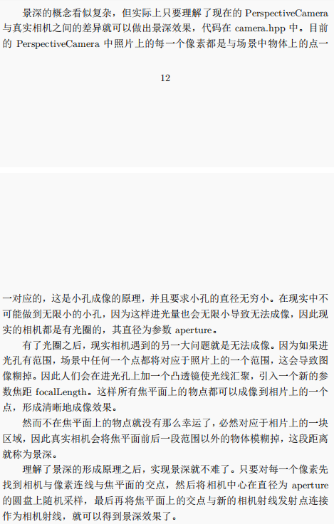

### 运动模糊

在读取物体时新增了velocity选项，给出运动向量，在求交时新增一个时间项，随机取[0, 1]的时间。以plane的求交为例：

```c++
    bool intersect(const Ray &r, Hit &h, float tmin, float time_) override {
        Vector3f origin = r.getOrigin();
        Vector3f direction = r.getDirection();
        if(is_moving)
            origin -= time_ * this->velocity;
            //求time_时刻物体的位置，实际上相当于光线起点向相反方向移动。其余与普通求交相同
			// ······
```

### 纹理贴图与凹凸贴图

#### Texture类

构造了```Texture```类，该类有以下成员函数。

##### int get_index(float u, float v)

UV位置是用于在三维模型表面上定义纹理映射的二维坐标系统。这个函数根据计算得到的uv位置获得纹理图中的位置，用于纹理贴图。

##### Vector3f get_color(float u, float v)

通过 uv 浮点数得到颜色，用于纹理贴图。

##### float get_gray(int index)

灰度图的转换，用于凹凸贴图。

##### float get_disturb(float u, float v, Vector2f &grad)

通过灰度图，得到梯度，用于凹凸贴图。

#### plane类

以平面```plane```类为例，其余类（如```sphere```类）省略

##### void get_uv(const Vector3f& p, float& u, float& v)

根据```p```点的位置来得到```u```, ```v```。这个函数在光线与平面相交时用到，，根据交点位置来得到```u```，```v```，然后得到material或者texture的```u```，```v```位置的颜色，累加到光线追踪算法中去。

### 求交加速（包围盒和层次结构）

主要代码在```mesh.hpp```和```mesh.cpp```里面

#### 结构体 Pel

结构体```Pel```代表一个AABB包围盒（用左下角顶点```minxyz```和右上角顶点```maxxyz```表示）

#### 结构体 BVH_TreeNode

代表层次包围体（Bounding volume hierarchies, BVH）的一个结点，多个层次包围体被组织成树的形式。

```C++
// BVH树的节点, 储存父子关系以及这一节点的AABB包围盒数据
// 如果是叶子节点，储存包含的图元AABB包围盒（连续储存，因此储存首个Pel的迭代器就行）
struct BVH_TreeNode {
    BVH_TreeNode* parent;
    BVH_TreeNode* lc;
    BVH_TreeNode* rc;
    Vector3f minxyz;
    Vector3f maxxyz;
    int pel_num;
    vector<Pel>::iterator first_pel; //有这个的是叶子节点
    BVH_TreeNode(BVH_TreeNode* a, vector<Pel>::iterator it, int _num);
};
```

##### 构造函数

详见注释

```C++
BVH_TreeNode::BVH_TreeNode(BVH_TreeNode* a, vector<Pel>::iterator it, int _num) {
    // BVH_TreeNode这个结构体的构造函数
    parent = a;
    lc = nullptr;
    rc = nullptr;
    first_pel = it;
    pel_num = _num;

    // _num代表了这个BVH_TreeNode存储了多少个图元Pel
    if(_num) {
        float minx = (*min_element(it, it + _num, Pel_min_x)).centroid.x();
        float miny = (*min_element(it, it + _num, Pel_min_y)).centroid.y();
        float minz = (*min_element(it, it + _num, Pel_min_z)).centroid.z();
        float maxx = (*max_element(it, it + _num, Pel_max_x)).centroid.x();
        float maxy = (*max_element(it, it + _num, Pel_max_y)).centroid.y();
        float maxz = (*max_element(it, it + _num, Pel_max_z)).centroid.z();
        minxyz = Vector3f(minx, miny, minz);
        maxxyz = Vector3f(maxx, maxy, maxz);
    }
}
```


#### Mesh类

##### 结构体TriangleIndex

继承自 PA1，就是一个三维数组，代表下标

##### 一些成员变量

```C++
vector<TriangleIndex> vIndex, tIndex, nIndex;// 对应一个平面的三个点的顶点下标、贴图下标、法线下标
vector<Vector3f> v, vn; // 对应 obj 文件中的一系列顶点和法线
vector<Vector2f> vt;  // 对应 obj 文件中贴图 uv 位置
vector<Object3D *> triangles;  // 储存每一个三角形
```

##### 构造函数

通过传入的mesh文件，构造出```Mesh```这个类的实体。同时，

+ 计算好法向量、纹理贴图等（```computeNormal()```, ```computeNormal_and_texture()```）
+ 计算好整个几何场景的AABB包围盒（```computeAABB()```）
+ 建立好 BVH 树（```setup_bvh_tree()```）

##### 析构函数

删除节点，释放空间

##### computeNormal()

根据三角面片的三个顶点，计算面法线。

##### computeNormal_and_texture()

设置三角面片的顶点法线（```set_vn```）和贴图 uv 位置（```set_vt```）。

##### produce_child(BVH_TreeNode* e)

对于一个```BVH_TreeNode```类型的节点```e```，根据空间位置，生成它的所有孩子。

具体方法是递归建树。思想可以参考这篇知乎（https://zhuanlan.zhihu.com/p/50720158?utm_source=wechat_session&utm_medium=social&utm_oi=813143391717163008&utm_campaign=shareopn）中的这一段话，简便起见直接放图：

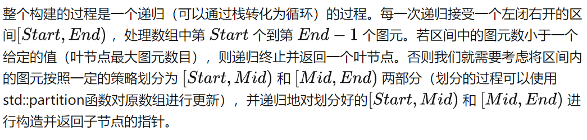

其中划分的过程由下面这句代码完成：

```C++
auto bound = partition(e->first_pel, e->first_pel + e->pel_num, comp);
```

```comp```这个函数指针代表了划分的标准。在上面这篇知乎中也探讨了划分的标准：

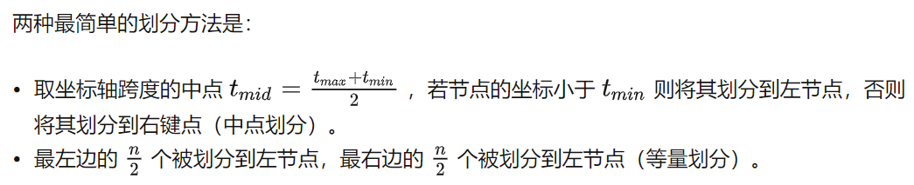

在代码中我的实现是取跨度最大的那个轴，然后实现中点划分。代码如下：

```C++
if (dx > dy && dx > dz) {
    comp = Pel_cen_x;
    now_center = e->minxyz.x() + dx / 2;
} else if (dy > dz){
    comp = Pel_cen_y;
    now_center = e->minxyz.y() + dy / 2;
} else {
    comp = Pel_cen_z;
    now_center = e->minxyz.z() + dz / 2;
}
```

##### setup_bvh_tree()

```new```一个根节点，对于根节点调用```produce_child```函数，一棵BVH树就这样建立好了。

##### Ray_hit_AABB(BVH_TreeNode* e, const Ray &r, float &the_t)

本质上是几何关系的处理，详见注释。

```C++
bool Ray_hit_AABB(BVH_TreeNode* e, const Ray &r, float &the_t) {

    // 首先判断BVH节点的pel_num属性是否为0，pel_num表示包围盒内物体的数量。
    // 如果为0，说明包围盒内没有物体，直接返回false，表示与包围盒不相交。
    if(e->pel_num == 0)
        return false;

    // 获取光线的起点和单位化的方向向量。
    Vector3f origin = r.getOrigin();
    Vector3f direction = r.getDirection().normalized();

    // 初始化t值的范围。
    // t_xmin和t_xmax表示光线与包围盒在X轴上的相交位置，初始值为负无穷和正无穷；
    float t_xmin = -1e38;
    float t_xmax = 1e38;
    float t_ymin = -1e38;
    float t_ymax = 1e38;
    float t_zmin = -1e38;
    float t_zmax = 1e38;

    // 根据光线的方向向量的正负情况，计算t值的范围。
    // 首先判断direction.x()的正负，如果大于0，则计算t_xmin和t_xmax的值，否则计算t_xmax和t_xmin的值。
    // 类似地，根据direction.y()和direction.z()的正负情况，计算t_ymin、t_ymax、t_zmin和t_zmax的值
    if(direction.x() > 1e-4) {
        t_xmin = (e->minxyz.x() - origin.x()) / direction.x();
        t_xmax = (e->maxxyz.x() - origin.x()) / direction.x();
    } else if(direction.x() < -1e-4) {
        t_xmax = (e->minxyz.x() - origin.x()) / direction.x();
        t_xmin = (e->maxxyz.x() - origin.x()) / direction.x();
    } else if(origin.x() > e->maxxyz.x() || origin.x() < e->minxyz.x())
        return false;

    // 对于每个轴上的t值范围，进行一些边界判断。
    // 如果t_xmax或t_ymax或t_zmax小于等于0，表示光线与包围盒在正方向上无相交，返回false
    if(t_xmax <= 0)
        return false;

    if(direction.y() > 1e-4) {
        t_ymin = (e->minxyz.y() - origin.y()) / direction.y();
        t_ymax = (e->maxxyz.y() - origin.y()) / direction.y();
    } else if(direction.y() < -1e-4) {
        t_ymax = (e->minxyz.y() - origin.y()) / direction.y();
        t_ymin = (e->maxxyz.y() - origin.y()) / direction.y();
    } else if(origin.y() > e->maxxyz.y() || origin.y() < e->minxyz.y())
        return false;

    if(t_ymax <= 0)
        return false;

    if(direction.z() > 1e-4) {
        t_zmin = (e->minxyz.z() - origin.z()) / direction.z();
        t_zmax = (e->maxxyz.z() - origin.z()) / direction.z();
    } else if(direction.z() < -1e-4) {
        t_zmax = (e->minxyz.z() - origin.z()) / direction.z();
        t_zmin = (e->maxxyz.z() - origin.z()) / direction.z();
    } else if(origin.z() > e->maxxyz.z() || origin.z() < e->minxyz.z())
        return false;

    if(t_zmax <= 0)
        return false;
    
    // 计算t值的范围的交集
    float t0, t1;
    t0 = max(t_zmin, max(t_xmin, t_ymin));
    t1 = min(t_zmax, min(t_xmax, t_ymax));
    // 判断t0和t1的关系。如果t0小于t1，说明光线与包围盒相交，选择t0和t1中较大的一个值作为相交点的参数t值，并返回true。
    // 如果t0大于等于t1，说明光线与包围盒没有相交，返回false
    if(t0 < t1) {
        the_t = (t0 > 0) ? t0 : t1;
        return true;
    } else {
        return false;
    }

};
```

##### intersect(const Ray &r, Hit &h, float tmin, float time_)

判断一条光线是否与mesh相交，详见注释。其中最主要的还是调用了```hit_intersect```函数。

```C++
bool Mesh::intersect(const Ray &r, Hit &h, float tmin, float time_) {
    bool result = false;

    // 根节点光线都没有撞上，那么肯定就是没有撞上
    float t;
    if(!Ray_hit_AABB(root, r, t))
        return false;

    if(!is_moving)
        // 光线没有移动的情况
        result = hit_intersect(r, h, tmin, root);
    else
        // 光线进行移动的情况
        result = hit_intersect(Ray(r.origin - time_ * velocity, r.direction), h, tmin, root);
    return result;
}
```

##### hit_intersect(const Ray &r, Hit &h, float tmin, BVH_TreeNode* e)

详见代码注释：

```C++
bool Mesh::hit_intersect(const Ray &r, Hit &h, float tmin, BVH_TreeNode* e) {//已经通过AABB包围盒测试的
    // 首先判断BVH节点的左子节点（lc）和右子节点（rc）是否都为空。
    // 如果是叶子节点，表示该节点所代表的几何体是三角形。
    // 对于每个三角形，调用其intersect方法，判断光线是否与三角形相交，更新相交点的信息。
    // 如果有任意一个相交结果为true，则返回true，表示光线与几何体相交。否则，返回false。
    if (e->rc == nullptr && e->lc == nullptr) {//叶子节点
        bool result = false;
        for (auto it = e->first_pel; it != e->first_pel + e->pel_num; ++it) {
            result |= ((Triangle *)triangles[(*it).index])->intersect(r, h, tmin, 0);
        }
        return result;
    }

    // 如果左子节点和右子节点不都为空，说明该节点是内部节点。
    // 首先调用Ray_hit_AABB函数判断光线是否与AABB包围盒相交，同时获取相交的参数t值（lc_t, rc_t）。
    float lc_t;
    float rc_t;
    bool lc_hit = Ray_hit_AABB(e->lc, r, lc_t);
    bool rc_hit = Ray_hit_AABB(e->rc, r, rc_t);

    // 左子节点和右子节点的相交结果都为false，说明光线与当前节点的AABB包围盒没有相交，返回false，表示光线与几何体没有相交。
    if(!(lc_hit || rc_hit))
        return false;

    bool real_hit;

    // 如果左子节点和右子节点的相交结果都为true，表示光线与两个子节点的AABB包围盒都相交。
    // 在这种情况下，根据t值的大小决定递归遍历左子树还是右子树。
    // 如果lc_t小于rc_t，先递归遍历左子树，如果返回true，则直接返回true，表示光线与几何体相交；如果返回false，则递归遍历右子树，并返回其结果。
    // 反之亦然
    if(lc_hit && rc_hit) {
        if(lc_t < rc_t) {
            real_hit = hit_intersect(r, h, tmin, e->lc);
            if(real_hit)
                return true;
            else
                real_hit = hit_intersect(r, h, tmin, e->rc);
            return real_hit;
        } else {
            real_hit = hit_intersect(r, h, tmin, e->rc);
            if(real_hit)
                return true;
            else
                real_hit = hit_intersect(r, h, tmin, e->lc);
            return real_hit;
        }
    } else if(lc_hit)
        return hit_intersect(r, h, tmin, e->lc); // 如果只有左子节点相交，递归遍历左子树，并返回结果。
    else
        return hit_intersect(r, h, tmin, e->rc); // 如果只有右子节点相交，递归遍历右子树，并返回结果。

};
```

## 参考文献

### PT算法

+ samllPt：http://www.kevinbeason.com/smallpt/#moreinfo

+ 对smallPt的讲解：https://zhuanlan.zhihu.com/p/490551718

### PPM算法

+ PM, PPM的原理及伪代码：https://zhuanlan.zhihu.com/p/396442970， https://zhuanlan.zhihu.com/p/208356944

+ PM, PPM, SPPM的原理：https://zhuanlan.zhihu.com/p/385099523

### 层次包围体算法

+ 原理：https://zhuanlan.zhihu.com/p/50720158?utm_source=wechat_session&utm_medium=social&utm_oi=813143391717163008&utm_campaign=shareopn

### 焦散功能

+ 原理：https://zhuanlan.zhihu.com/p/385099523?utm_id=0
+ specular究竟是什么：https://zhuanlan.zhihu.com/p/541037784

### 软阴影

+ https://zhuanlan.zhihu.com/p/143275138

### 凹凸贴图

+ https://blog.csdn.net/archielau/article/details/9124341

### honor code

+ 借鉴了代码仓库 https://github.com/Guangxuan-Xiao/THU-Computer-Graphics-2020 与 https://github.com/bebr2/THUComputerGraphics
+ 与计0的王畅越、计1的张航宇讨论了代码实现

## 最后结果

### ball

使用了pt算法

可以看到反射、折射与阴影

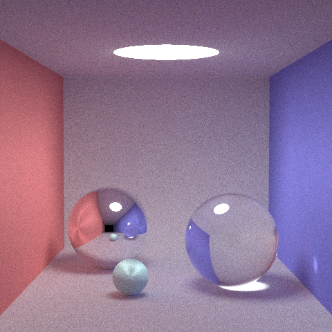

### moving 

使用了pt算法

+ 凹凸贴图（绿球）
+ 纹理贴图（背后的墙壁）
+ 运动模糊（运动的小刀）

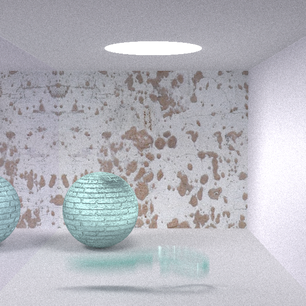

### water

使用了ppm算法，可以看到水面波光粼粼的焦散现象。

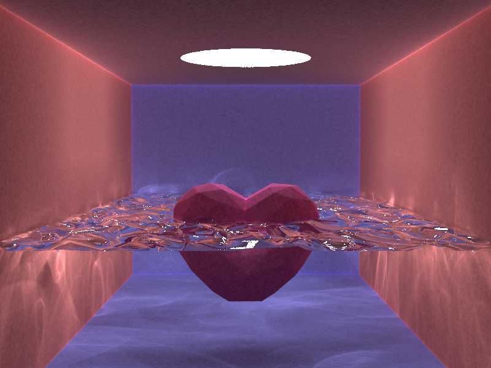

### rabit

使用了ppm算法

+ 焦散
+ 软阴影
+ 法向插值（兔子）
+ 纹理贴图（球面）
+ 折射反射

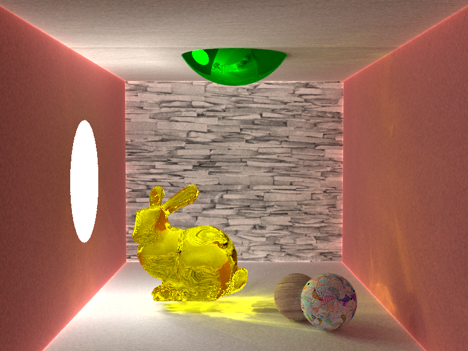

### glass

使用了ppm算法，可以看到景深效果

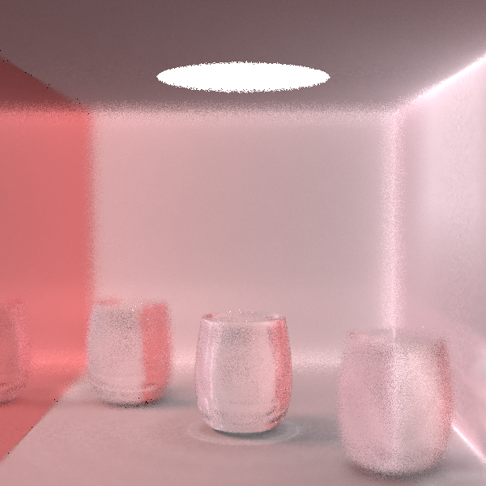
